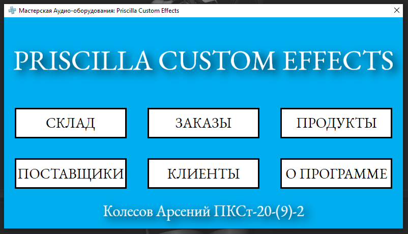

# 🧢PostgreSQL Management Program with .NET-7



## Overview

This is a management program designed to work seamlessly with PostgreSQL databases using the .NET-7 framework. It provides a user-friendly interface for database management tasks, allowing users to interact with PostgreSQL databases efficiently.

## Requirements

- .NET-7 runtime
- PostgreSQL

## Installation

Clone the repository:

```bash
git clone https://github.com/masajinobe-ef/pfx-workshop
```

## License

This project is licensed under the GPL-3.0 license.
